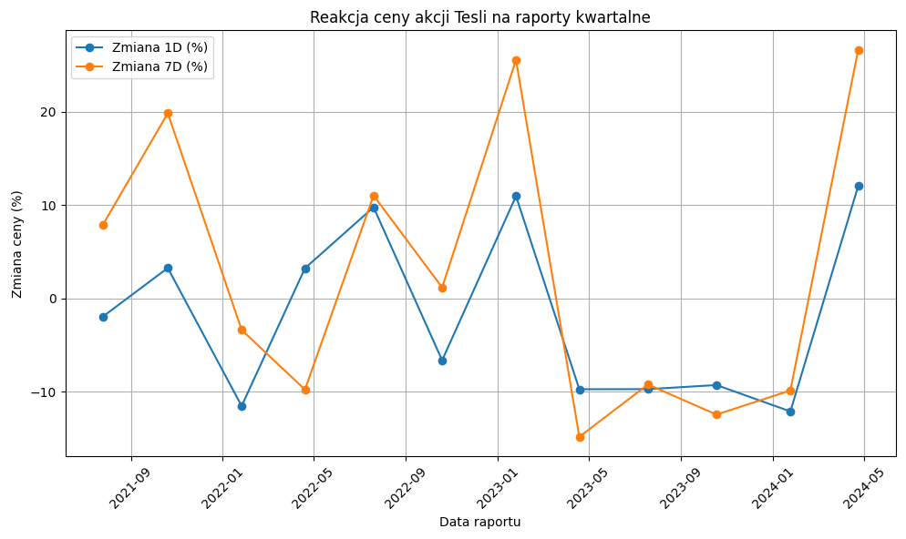
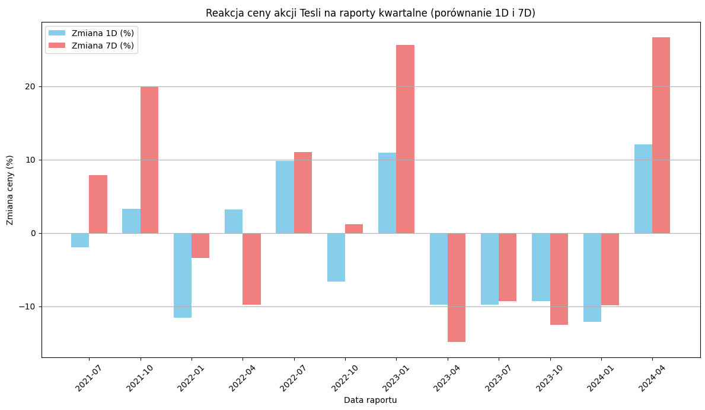
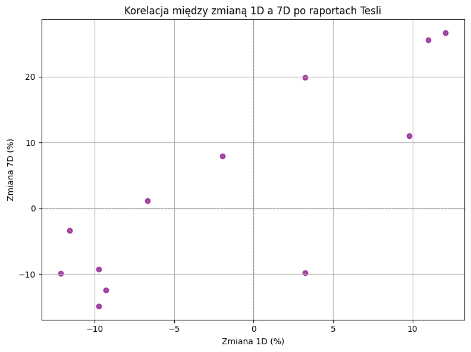
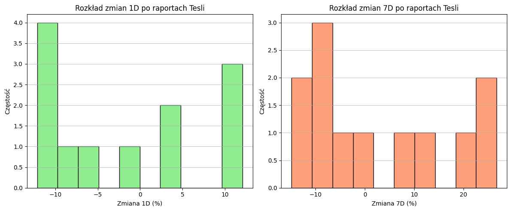

# Analiza Reakcji Ceny Akcji Tesli na Raporty Kwartalne

## Opis projektu
Ten projekt analizuje, jak cena akcji Tesli ($TSLA) reaguje na publikację raportów kwartalnych. Badane są zmiany cenowe w perspektywie 1 dnia i 7 dni po dacie raportu.

## Dane
Dane historyczne cen akcji Tesli pobierane są za pomocą biblioteki `yfinance` dla okresu od 2021 do 2024 roku.

## Analizowane metryki
* **Zmiana 1D (%)**: Procentowa zmiana ceny akcji między zamknięciem dnia poprzedzającego raport a zamknięciem dnia następnego.
* **Zmiana 7D (%)**: Procentowa zmiana ceny akcji między zamknięciem dnia poprzedzającego raport a zamknięciem 7 dni po raporcie.

## Wizualizacje
Poniżej przedstawiono kluczowe wykresy generowane przez skrypt, wizualizujące reakcję ceny akcji Tesli.

### Reakcja ceny akcji Tesli na raporty kwartalne (liniowy)
Wykres przedstawia procentowe zmiany ceny akcji Tesli (1 dzień i 7 dni po raporcie) w funkcji daty raportu.



### Porównanie zmian 1D i 7D po raportach (słupkowy)
Wykres słupkowy pozwala na łatwe porównanie skali zmian 1-dniowych i 7-dniowych dla każdego raportu.



### Korelacja między zmianą 1D a 7D
Wykres rozrzutu pokazuje, czy istnieje widoczna korelacja między krótkoterminową a nieco dłuższą reakcją rynkową.



### Rozkład zmian 1D i 7D (histogramy)
Histogramy przedstawiają częstość występowania poszczególnych zakresów zmian procentowych, dając wgląd w ogólny sentyment rynku.



## Analiza i Wnioski

Na podstawie powyższych wizualizacji i tabeli wyników (`df_results`) można wyciągnąć następujące wnioski:

### Ogólne obserwacje:
* **Wysoka Zmienność:** Cena akcji Tesli wykazuje znaczną zmienność w odpowiedzi na raporty kwartalne. Wahania są często dwucyfrowe, co świadczy o silnej reakcji rynku na ogłaszane wyniki i prognozy.
* **Brak Spójnego Kierunku:** Reakcje są bardzo zróżnicowane. Nie ma wyraźnego, stałego trendu wskazującego na konsekwentne wzrosty lub spadki po każdym raporcie. Cena akcji reaguje w zależności od konkretnych wyników finansowych, oczekiwań analityków i szerszego kontekstu rynkowego.

### Porównanie zmian 1D i 7D:
* **Krótkoterminowa vs. Długoterminowa Reakcja:** Często, choć nie zawsze, zmiana 7-dniowa jest bardziej wyraźna (pozytywna lub negatywna) niż zmiana 1-dniowa. Może to oznaczać, że rynek potrzebuje więcej czasu na pełne przetrawienie informacji zawartych w raporcie lub że w ciągu tygodnia pojawiają się dodatkowe czynniki (np. komentarze analityków, wiadomości branżowe), które wpływają na cenę.
    * **Wzmocnienie trendu:** W przypadkach silnych wzrostów (np. styczeń 2023, kwiecień 2024), początkowa pozytywna reakcja 1D często była kontynuowana i wzmacniana w perspektywie 7 dni. Podobnie w przypadku silnych spadków (np. styczeń 2022, kwiecień 2023), początkowe straty często pogłębiały się.
    * **Korekta/Odbicie:** Zdarzają się sytuacje, gdzie początkowa reakcja 1D jest korygowana w ciągu 7 dni (np. niewielki spadek 1D, po którym następuje wzrost 7D, lub odwrotnie).

### Trendy:
* **Okresy Negatywnych Reakcji:** Zwraca uwagę okres końca 2023 i początku 2024 roku, gdzie widoczne są tendencje do spadków po raportach kwartalnych. Może to być związane z obawami o konkurencję, spowolnienie wzrostu, czy ogólny sentyment do akcji technologicznych.
* **Silne Wzrosty:** Odnotowano również okresy bardzo silnych pozytywnych reakcji, szczególnie na początku 2023 roku oraz w kwietniu 2024. Te wzrosty często następują po raportach, które zaskakują rynek pozytywnie lub zmieniają narrację wokół firmy.

### Co to może oznaczać:
* **Spekulacyjny charakter:** Akcje Tesli są często postrzegane jako spekulacyjne, a raporty kwartalne są kluczowymi wydarzeniami, które mogą wywoływać duże ruchy. Inwestorzy reagują nie tylko na same liczby, ale także na ton prognoz, plany produktowe i wypowiedzi zarządu.
* **Wpływ ogólnych warunków rynkowych:** Reakcje na raporty nie są oderwane od szerszych warunków makroekonomicznych i sentymentu rynkowego. Np. w okresach globalnej niepewności, nawet dobre wyniki mogą być słabiej nagradzane.

Podsumowując, cena akcji Tesli reaguje na raporty kwartalne w sposób dynamiczny i często nieprzewidywalny. Długoterminowa reakcja (7 dni) często wzmacnia lub koryguje początkową reakcję jednodniową, co sugeruje potrzebę czasu na pełne przetrawienie informacji przez rynek.
## Jak uruchomić projekt
1.  Sklonuj repozytorium:
    ```bash
    git clone [https://github.com/SzymonSzulik47/Tesla-Stock-Analysis.git](https://github.com/SzymonSzulik47/Tesla-Stock-Analysis.git)
    ```
2.  Przejdź do folderu projektu:
    ```bash
    cd Tesla-Stock-Analysis
    ```
3.  Zainstaluj wymagane biblioteki:
    ```bash
    pip install -r requirements.txt
    ```
4.  Uruchom skrypt Python:
    ```bash
    python tesla_earnings_analysis.py
    ```

## Wymagania
* Python 3.x
* Biblioteki: `yfinance`, `pandas`, `matplotlib`
